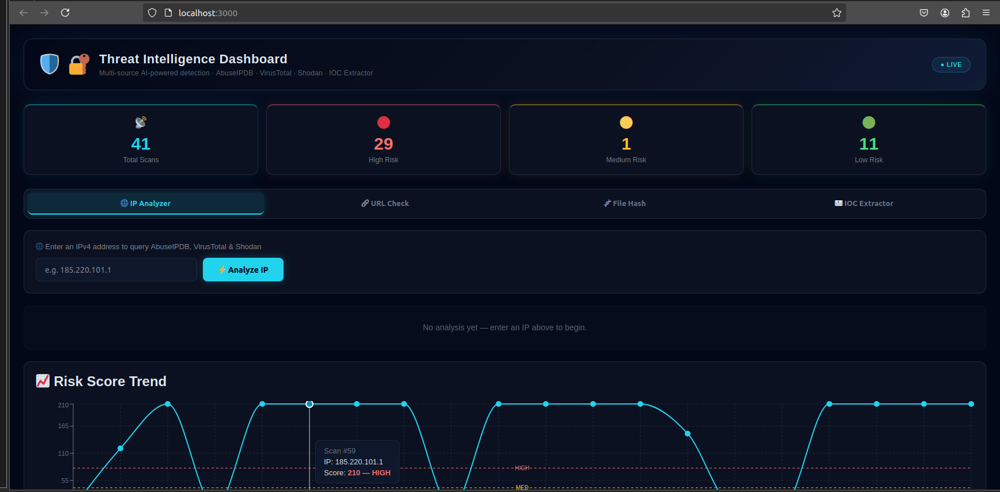
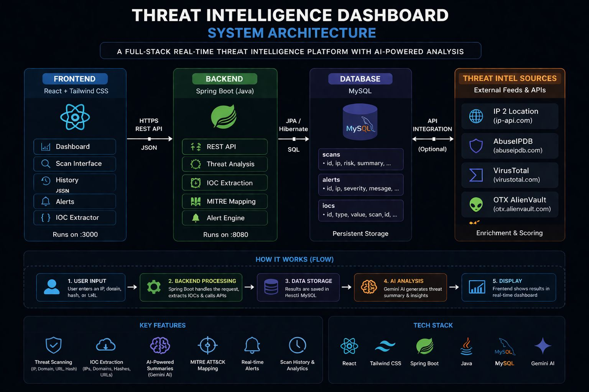
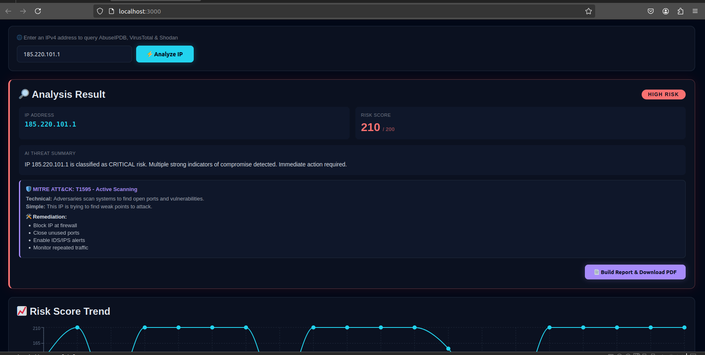
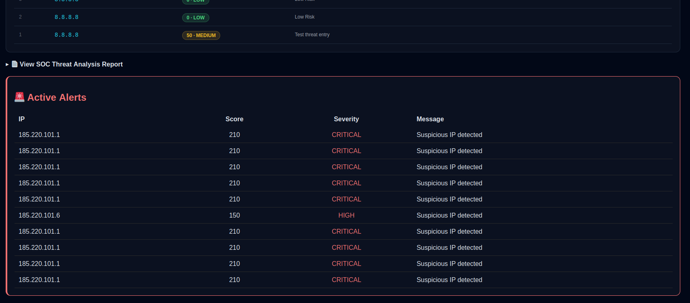
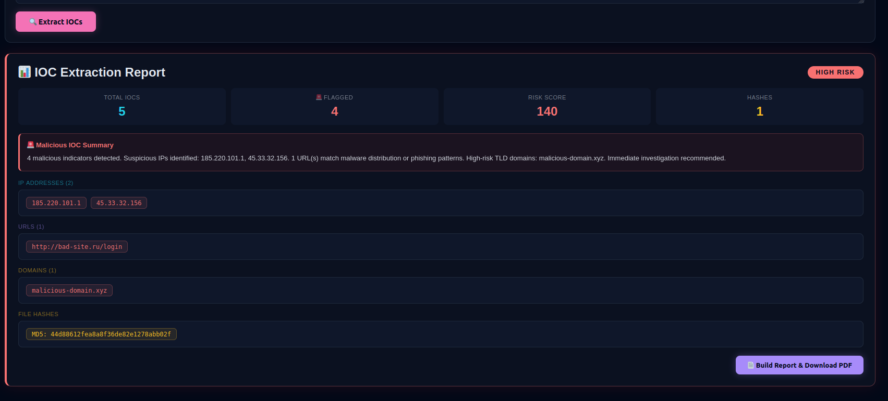

# 🛡️ Threat Intelligence Dashboard

> Full-stack SOC analyst platform for multi-source IOC enrichment, risk scoring, MITRE ATT&CK mapping, and automated threat reporting — built with React + Spring Boot.



---

## Overview

This project replicates a core SOC analyst workflow: ingest an indicator, enrich it across multiple threat intelligence sources, score it, map it to an adversary technique, and produce a structured report — all without leaving a single interface.

It is not a UI wrapper around an API. The backend implements a proper layered architecture with a domain model, service layer, PDF report generator, RFC 9457 error responses, and Bean Validation. The frontend implements tab-isolated analysis flows, a real-time alert engine, a client-side IOC extractor, and risk trend visualization across scan history.

---

## Architecture



The system is split into two independently runnable services:

**Frontend (React)** — handles user input, validation, tab routing, chart rendering, IOC extraction, and PDF report generation via the browser print API.

**Backend (Spring Boot)** — exposes REST endpoints for IP, URL, and hash analysis. Aggregates signals from AbuseIPDB, VirusTotal, and Shodan. Applies a four-tier risk classifier, maps detections to MITRE ATT&CK techniques, and renders structured PDF reports via Apache PDFBox.

---

## Features

**IP Analysis** — Queries AbuseIPDB abuse confidence score, VirusTotal malicious detections, and Shodan exposed service count. Computes a composite risk score (0–200), classifies severity across four tiers, and maps to the most relevant MITRE ATT&CK technique.

**URL Analysis** — Evaluates URLs for phishing patterns, malware distribution indicators, and suspicious TLD/path combinations. Falls back to heuristic scoring when the backend is unreachable.

**File Hash Analysis** — Submits MD5, SHA1, or SHA256 hashes against VirusTotal's AV engine database. Returns malicious, suspicious, undetected, and harmless engine counts with a full analysis summary.

**IOC Extractor** — Client-side extraction engine that parses raw text (email headers, SIEM alerts, log dumps) and classifies IPs, URLs, domains, email addresses, MD5s, SHA1s, and SHA256 hashes. Flags suspicious indicators using pattern matching and high-risk TLD detection. Computes a weighted risk score and feeds critical findings into the alert engine.

**Alert Engine** — Generates structured alerts for any scan or IOC extraction exceeding the HIGH threshold (score > 70). Classifies as CRITICAL above 150. Persists alerts to the backend and renders an active alert panel on the dashboard.

**Risk Trend Chart** — Plots risk scores across the last 20 scans with reference lines at the HIGH (80) and MEDIUM (40) thresholds. Tooltip shows scan ID, IP, score, and severity classification.

**PDF Report Generation** — Produces a styled, multi-page PDF containing executive summary, technical indicators, MITRE ATT&CK mapping, business impact assessment, and prioritised remediation steps. Available for all four analysis types.

---

## Screenshots

### High Risk IP Detection


### Scan History & Risk Trend


### Active Alerts Panel


### IOC Extraction Report


---

## Tech Stack

### Frontend
- React 18 (hooks-based, no class components)
- Recharts — risk trend line chart
- Browser Print API — PDF report generation
- Client-side IOC extraction engine (regex + heuristic scoring)

### Backend
- Spring Boot 3
- Apache PDFBox 3 — structured PDF report rendering
- Bean Validation (Jakarta) — input validation on all endpoints
- RFC 9457 ProblemDetail — standardised error responses
- REST (JSON) — IP, URL, hash, history, and alert endpoints

---

## Detection Logic

Risk scoring is computed as a weighted composite across three signal sources:

| Signal | Weight |
|---|---|
| AbuseIPDB confidence score | Primary |
| VirusTotal malicious engine count | Secondary |
| Shodan exposed service count | Supporting |

Severity thresholds:

| Score | Classification |
|---|---|
| 0 – 39 | LOW |
| 40 – 79 | MEDIUM |
| 80 – 149 | HIGH |
| 150 – 200 | CRITICAL |

Alert thresholds: score > 70 triggers HIGH alert, score > 150 triggers CRITICAL alert.

IOC risk scoring weights: flagged IPs (×40), suspicious URLs (×30), high-risk domains (×25), suspicious emails (×15), file hashes (×5). Score is capped at 200.

---

## MITRE ATT&CK Mapping

| Technique ID | Name | Tactic | Trigger Condition |
|---|---|---|---|
| T1595 | Active Scanning | Reconnaissance | Score ≥ 80 |
| T1190 | Exploit Public-Facing Application | Initial Access | Score ≥ 80 |
| T1046 | Network Service Discovery | Discovery | Exposed services > 2 |
| T1071 | Application Layer Protocol | Command and Control | Abuse score ≥ 80 |

---

## Project Structure

```
threat-intel-dashboard/
├── backend/
│   ├── src/main/java/com/security/threatintel/
│   │   ├── controller/      # ReportController — thin HTTP adapter
│   │   ├── service/         # ThreatReportService, PdfReportGenerator
│   │   ├── domain/          # ThreatReport (Builder), MitreAttackTechnique (Record)
│   │   └── exception/       # GlobalExceptionHandler, ReportNotFoundException
│   └── pom.xml
├── frontend/
│   ├── public/
│   └── src/
│       └── App.js           # Tab routing, analysis flows, alert engine, chart
├── screenshots/
└── README.md
```

-----

## Running the Project

### Backend

```bash
cd backend
./mvnw spring-boot:run
```

Runs on `http://localhost:8080`

### Frontend

```bash
cd frontend
npm install
npm start
```

The frontend connects to `http://localhost:8080` by default. Both services must be running for full functionality. The frontend degrades gracefully to heuristic scoring if the backend is unreachable.

-----

## API Endpoints

|Method|Endpoint                        |Description                   |
|------|--------------------------------|------------------------------|
|GET   |`/api/threat/analyze?ip=`       |IP enrichment and risk scoring|
|GET   |`/api/threat/analyze-url?url=`  |URL threat analysis           |
|GET   |`/api/threat/analyze-hash?hash=`|File hash AV lookup           |
|GET   |`/api/threat/history`           |Scan history                  |
|GET   |`/api/threat/alerts`            |Active alert feed             |
|GET   |`/api/v1/threat/report/{id}`    |PDF report download           |

-----

## Why This Project

Most portfolio projects demonstrate that someone can call an API and render the response. This one demonstrates something different: how a SOC analyst thinks.

The detection logic mirrors real triage decisions — composite scoring across multiple sources, threshold-based escalation, MITRE technique mapping based on observed behaviour, and structured reporting that separates executive summary from technical indicators. The architecture mirrors how production security tooling is actually built — not one monolithic function, but a service layer that enriches, a domain model that enforces invariants, and a controller that stays out of the way.

-----

*Built by Solomon James — Cybersecurity Analyst | Detection Engineering | SOC Operations*
